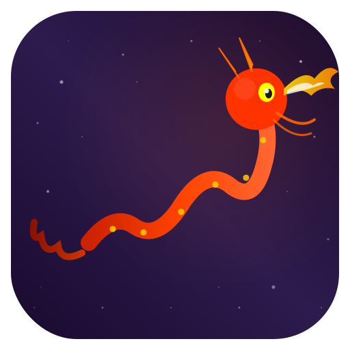

# ScreenPets

<p align="center">
  
</p>

<p align="center">
  A native macOS menu bar app with animated desktop pets roaming across your screen(s).
</p>

<p align="center">
  <a href="https://developer.apple.com/swift/"></a>
  <a href="https://github.com/sealovesky/ScreenPets/releases"></a>
  <a href="LICENSE"></a>
  <a href="https://github.com/sealovesky/ScreenPets/stargazers"></a>
</p>

<p align="center">
  
  
</p>

[English](#english) | [中文](#中文)

---

## English

### Introduction

ScreenPets is a lightweight macOS menu bar application that brings back the nostalgic desktop pet experience. Watch cute animated pets roam across your screen while you work. Supports multiple monitors and various movement modes.

### Features

#### Multiple Pets
- **Dragon** - A fiery Chinese dragon breathing flames
- **Nyan Cat** - The iconic rainbow cat from the meme
- **Ghost** - A friendly floating ghost

#### Movement Modes
- **Secondary Screen Only** - Pet stays on non-primary displays
- **Cross Screen** - Pet moves across all connected screens
- **Free Roam** - Pet flies freely in any direction across the entire screen

#### Multi-Screen Support
- Seamless movement across multiple monitors
- Proper coordinate transformation between screens
- Each screen gets its own rendering window

#### Customization
- Adjustable pet size (0.5x to 3x scale)
- Always on top rendering (above menu bar and dock)
- Easy toggle on/off from menu bar

### Screenshots

<!-- TODO: Add screenshots -->
<p float="left">
  
  
</p>

### Installation

#### Requirements
- macOS 14.0 (Sonoma) or later
- Xcode 15.0 or later (for building from source)

#### From Source

```bash
# Clone the repository
git clone https://github.com/sealovesky/ScreenPets.git
cd ScreenPets

# Open in Xcode
open ScreenPets.xcodeproj

# Build and run (⌘R)
```

#### Download Release

Check the [Releases](https://github.com/sealovesky/ScreenPets/releases) page for pre-built binaries.

### Usage

1. **Launch** - ScreenPets appears in your menu bar
2. **Click** - Click the menu bar icon to open settings
3. **Configure** - Choose pet type, movement mode, and size
4. **Toggle** - Use the switch to enable/disable the pet

### Project Structure

```
ScreenPets/
├── ScreenPetsApp.swift          # App entry point (MenuBarExtra)
├── Models/
│   ├── Pet.swift                # Pet protocol & PetType enum
│   └── PetSettings.swift        # SettingsManager (UserDefaults)
├── Pets/
│   ├── DragonPet.swift          # Dragon implementation
│   ├── NyanCatPet.swift         # Nyan Cat implementation
│   └── GhostPet.swift           # Ghost implementation
├── Managers/
│   ├── PetManager.swift         # Pet lifecycle & animation loop
│   └── PetWindowController.swift # Multi-screen window management
├── Views/
│   └── SettingsView.swift       # Settings panel UI
└── Resources/
    ├── AppIcon.svg              # App icon source
    └── Assets.xcassets/         # Asset catalog
```

### Tech Stack

- **UI Framework**: SwiftUI
- **Window Management**: AppKit (NSWindow)
- **Animation**: CVDisplayLink (60fps)
- **Drawing**: SwiftUI Canvas / GraphicsContext
- **Settings**: UserDefaults via @AppStorage

### Roadmap

- [ ] More pet types (cat, dog, bird, fish, etc.)
- [ ] Pet interactions (click reactions, idle animations)
- [ ] Sound effects
- [ ] Speed adjustment slider
- [ ] Launch at login option
- [ ] Keyboard shortcuts
- [ ] Drag to reposition pets
- [ ] Multiple pets simultaneously
- [ ] Pet mood/state system
- [ ] Custom pet creator/importer

### License

MIT License - see [LICENSE](LICENSE) for details.

---

## 中文

### 简介

ScreenPets 是一款轻量级的 macOS 菜单栏应用，让你重温经典的桌面宠物体验。看着可爱的动画宠物在你的屏幕上漫游，支持多显示器和多种移动模式。

### 功能特性

#### 多种宠物
- **飞龙** - 喷火的中国龙
- **彩虹猫** - 经典的 Nyan Cat 彩虹猫
- **幽灵** - 可爱的漂浮幽灵

#### 移动模式
- **副屏模式** - 宠物只在副屏上活动
- **跨屏模式** - 宠物在所有屏幕之间移动
- **自由飞行** - 宠物在整个屏幕自由飞行

#### 多屏支持
- 跨多个显示器无缝移动
- 正确的屏幕间坐标转换
- 每个屏幕独立渲染窗口

#### 自定义选项
- 可调节宠物大小（0.5x 到 3x）
- 始终置顶显示（在菜单栏和 Dock 之上）
- 菜单栏一键开关

### 截图

<!-- TODO: 添加截图 -->
<p float="left">
  
  
</p>

### 安装

#### 环境要求
- macOS 14.0 (Sonoma) 或更高版本
- Xcode 15.0 或更高版本（从源码构建）

#### 从源码构建

```bash
# 克隆仓库
git clone https://github.com/sealovesky/ScreenPets.git
cd ScreenPets

# 用 Xcode 打开
open ScreenPets.xcodeproj

# 构建运行 (⌘R)
```

#### 下载发布版

前往 [Releases](https://github.com/sealovesky/ScreenPets/releases) 页面下载预编译版本。

### 使用方法

1. **启动** - ScreenPets 会出现在菜单栏
2. **点击** - 点击菜单栏图标打开设置
3. **配置** - 选择宠物类型、移动模式和大小
4. **开关** - 使用开关启用/禁用宠物

### 项目结构

```
ScreenPets/
├── ScreenPetsApp.swift          # 应用入口 (MenuBarExtra)
├── Models/
│   ├── Pet.swift                # 宠物协议和类型枚举
│   └── PetSettings.swift        # 设置管理器 (UserDefaults)
├── Pets/
│   ├── DragonPet.swift          # 飞龙实现
│   ├── NyanCatPet.swift         # 彩虹猫实现
│   └── GhostPet.swift           # 幽灵实现
├── Managers/
│   ├── PetManager.swift         # 宠物生命周期和动画循环
│   └── PetWindowController.swift # 多屏窗口管理
├── Views/
│   └── SettingsView.swift       # 设置界面
└── Resources/
    ├── AppIcon.svg              # 应用图标源文件
    └── Assets.xcassets/         # 资源目录
```

### 技术栈

- **UI 框架**: SwiftUI
- **窗口管理**: AppKit (NSWindow)
- **动画循环**: CVDisplayLink (60fps)
- **绘制**: SwiftUI Canvas / GraphicsContext
- **设置存储**: UserDefaults (@AppStorage)

### 开发计划

- [ ] 更多宠物类型（猫、狗、鸟、鱼等）
- [ ] 宠物交互（点击反应、待机动画）
- [ ] 音效
- [ ] 速度调节滑块
- [ ] 开机自启动选项
- [ ] 快捷键支持
- [ ] 拖拽移动宠物
- [ ] 多宠物同时显示
- [ ] 宠物情绪/状态系统
- [ ] 自定义宠物创建器

### 许可证

MIT License - 详见 [LICENSE](LICENSE)

---

## Contributing

Contributions are welcome! Please feel free to submit a Pull Request.

1. Fork the repository
2. Create your feature branch (`git checkout -b feature/AmazingFeature`)
3. Commit your changes (`git commit -m 'Add some AmazingFeature'`)
4. Push to the branch (`git push origin feature/AmazingFeature`)
5. Open a Pull Request

## Acknowledgments

- Inspired by classic desktop pets from the 90s/2000s (eSheep, Shimeji, etc.)
- Built with SwiftUI and AppKit
- Dragon design inspired by traditional Chinese art
